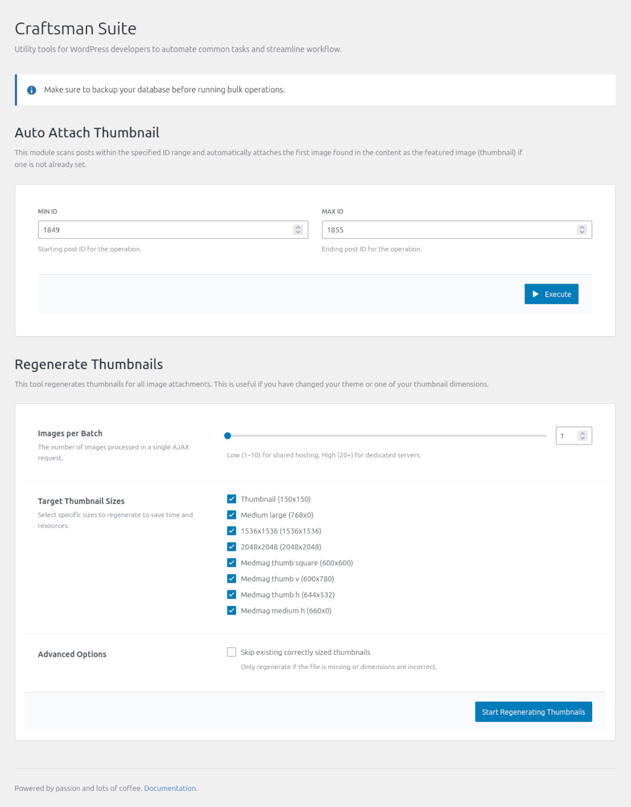

# Craftsman Suite

Craftsman Suite is the ultimate developer's workbench for WordPress theme mastery. It streamlines your workflow by automating tedious tasks: auto-attaching thumbnails, bulk regenerating images, and monitoring logs in real-time.


**Recently Refactored:** The plugin has been completely migrated to a modern **ReactJS** application, providing a seamless and responsive user interface within the WordPress admin dashboard.

## Features

- **Modern React UI**: A completely rewritten user interface using ReactJS and Tailwind CSS for a fast, modern experience.
- **Auto Attach Thumbnail**: Automatically attach thumbnails to posts or media items within a specified ID range.
- **Regenerate Thumbnails**: Bulk regenerate thumbnails for your media library.
- **Dark Mode Support**: Automatically adapts to your system's color scheme.
- **Developer Tools Dashboard**: Access all tools from **Tools → Dev Tools** menu in WordPress admin.



## Tech Stack

- **Frontend**: ReactJS, Tailwind CSS, WordPress Element (@wordpress/element).
- **Backend**: Modern PHP (OOP, PSR-4), WordPress REST API.
- **Build Tools**: @wordpress/scripts, PostCSS.

## Requirements

- WordPress 5.0 or higher (Gutenberg support required for React components).
- PHP 7.4 or higher.

## Installation

1. Download the plugin.
2. Extract to `/wp-content/plugins/craftsman-suite/`.
3. Activate the plugin from the WordPress admin panel.

## Development Setup

If you want to contribute or modify the plugin code, follow these steps:

### Prerequisites
- Node.js & npm
- Composer

### Setup
1. Clone the repository.
2. Install PHP dependencies:
   ```bash
   composer install
   ```
3. Install JavaScript dependencies:
   ```bash
   npm install
   ```

### Build Commands
- **Start Development Server**:
  ```bash
  npm run start
  ```
  or
  ```bash
  npm run dev
  ```
- **Build for Production**:
  ```bash
  npm run build
  ```
- **Format Code**:
  ```bash
  npm run format
  ```

## Usage

Navigate to **Tools → Craftsman Suite** in your WordPress admin panel to access the developer tools interface.

## License

GNU General Public License v3 or later

## Author

tranthethang - [GitHub Profile](https://github.com/tranthethang)
